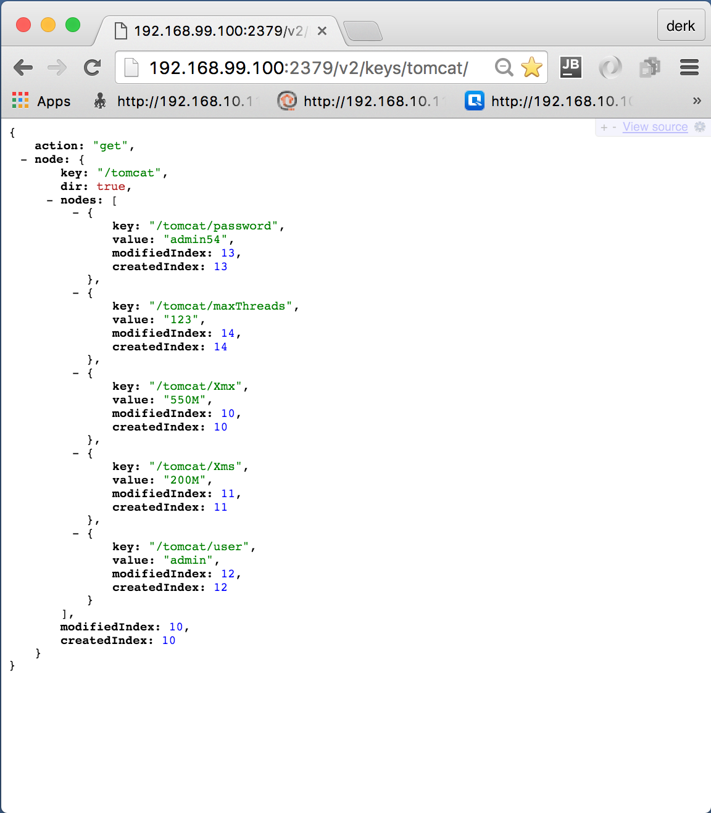
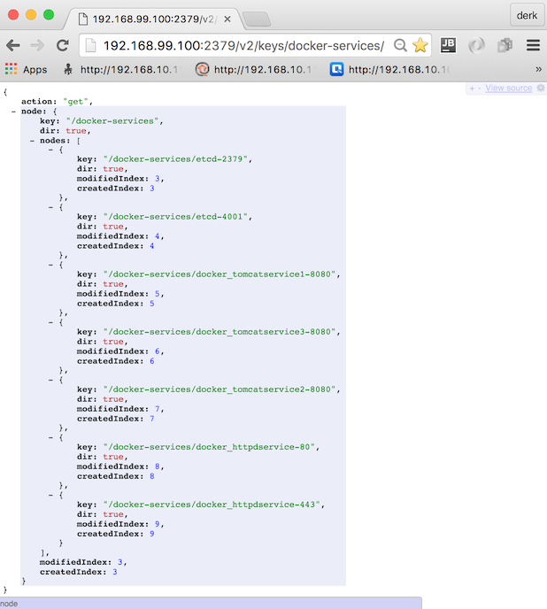
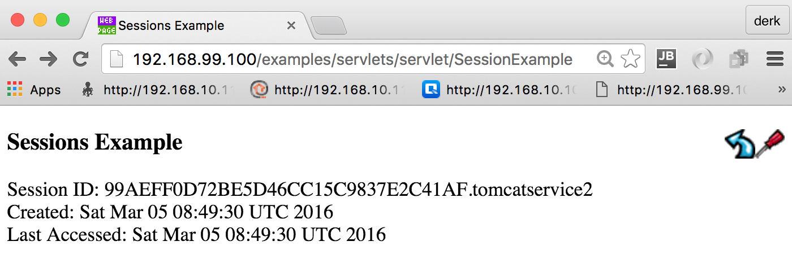

# tomcat-conf
This is a starting point for running and administrating multiple [Apache Tomcat](http://tomcat.apache.org/) using a central Configuration Repository - here [etcd](https://github.com/coreos/etcd).

The main subject under test&sample is [confd](https://github.com/kelseyhightower/confd). It is a tiny  useful tool to move distributed local configuration files to a central configuration repositories. Various other configuration repositories like [etcd](https://github.com/coreos/etcd), [redis](http://redis.io), [consul](http://consul.io), [dynamodb](http://aws.amazon.com/dynamodb/), [zookeeper](https://zookeeper.apache.org) could be used instead of etcd if required.   

Here we use [Apache httpd](http://httpd.apache.org/) as a reverse proxy for load balancing. Why? It is since 1996 the most popular WebServer and it works fine :)

## what is this sample doing?
Apache Tomcat uses config files e.g. ```tomcat-users.xml``` to define access rights to the manager webapp or ```server.xml``` to define connectors. Here the admin credentials shall be configured centrally, so we can change them within etcd.

The full list of confd responsible configurations - all of them stored in etcd under the prefix 'tomcat':
- ```Xmx```: maximum heap size
- ```Xms```: initial heap size
- ```username```: manager webapp username
- ```password```: manager webapp password
- ```maxThreads```: count of threads for a connector
- ```jvmRoute```: here Tomcat hostname (as defined in docker-compose.yml)

Apache httpd is forwarding requests via mod_proxy_ajp to the Tomcats. To register all running Containers gliderlabs/registrator will be used.    

## run it
This sample uses Vagrant and VMware or VirtualBox. Vagrant is optional - you can build and run the Containers via docker-compose.yml also directly in your prefered Docker environment. A Docker-Compose file exists for that. 

### run it via Vagrant
```
vagrant plugin list
vagrant plugin install vagrant-docker-compose
```
Clone this repo, run it
```
git clone https://github.com/muenchhausen/tomcat-confd.git
cd tomcat-confd
vagrant up
```

Find out the IP of your VM - e.g. login into the VM (sometimes credentials ```vagrant vagrant``` are required)
```
vagrant ssh
ifconfig
```

### run it directly with Docker Compose
```
cd tomcat-confd/docker
docker-compose build
docker-compose up
```

### try Tomcat in your Browser
Open your Browser, go to Tomcat Manager 
http://192.168.99.100:8081/manager/
login with credentials ```admin``` and ```admin```

try also second Tomcat Manager 
http://192.168.99.100:8082/manager/
login with same credentials as above

### try etcd in your Browser

Look to your Tomcat keys and Values:
http://192.168.99.100:2379/v2/keys/tomcat/



Look what gliderlabs/registrator added:
http://192.168.99.100:2379/v2/keys/docker-services/



### try Apache httpd reverse proxy in your Browser

Look to Apache server-status:
http://192.168.99.100/server-status/

Access the Tomcat default Sample over httpd: 
http://192.168.99.100/examples/servlets/servlet/SessionExample
You will see that the session id alternates if you refresh the browser



### CoreOS Meetup Munich 2016-03-03
here are the [slides](slides/Configure-a-Tomcat-cluster-with-confd.pdf)
and the [presentation](https://www.youtube.com/watch?v=y0cqKHsXkk4)

## some interesting code snippets

Besides the automatic ```vagrant up``` way, you can play around with manual steps. Here some ideas...

manually rebuild everything within the VM
```
sudo su -
cd /vagrant/docker
docker-compose stop && docker-compose rm -f && docker-compose build && docker-compose up --force-recreate
```

open another bash - fill in the required etcd keys - after doing this tomcat should start

if using vagrant:
```
curl -L http://localhost:2379/v2/keys/tomcat/Xmx -XPUT -d value='1024M' && \
curl -L http://localhost:2379/v2/keys/tomcat/Xms -XPUT -d value='512M' && \
curl -L http://localhost:2379/v2/keys/tomcat/user -XPUT -d value='admin' && \
curl -L http://localhost:2379/v2/keys/tomcat/password -XPUT -d value='admin' && \
curl -L http://localhost:2379/v2/keys/tomcat/maxThreads -XPUT -d value='123'

```
if using docker tools - find out ip with ```docker-machine env``` then run e.g.
```
curl -L http://192.168.99.100:2379/v2/keys/tomcat/Xmx -XPUT -d value='1024M' && \
curl -L http://192.168.99.100:2379/v2/keys/tomcat/Xms -XPUT -d value='512M' && \
curl -L http://192.168.99.100:2379/v2/keys/tomcat/user -XPUT -d value='admin' && \
curl -L http://192.168.99.100:2379/v2/keys/tomcat/password -XPUT -d value='admin' && \
curl -L http://192.168.99.100:2379/v2/keys/tomcat/maxThreads -XPUT -d value='123'
```

debug confd - e.g. test if templates are ok
```
/usr/local/bin/confd -onetime -backend etcd -node docker_etcdservice_1:4001
```

## open issues - what's next?
- try latest confd version v0.12 and define default values getv within template files.
- how to handle consistent configuration changes with confd
- confd for Windows :)